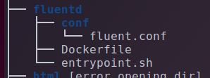
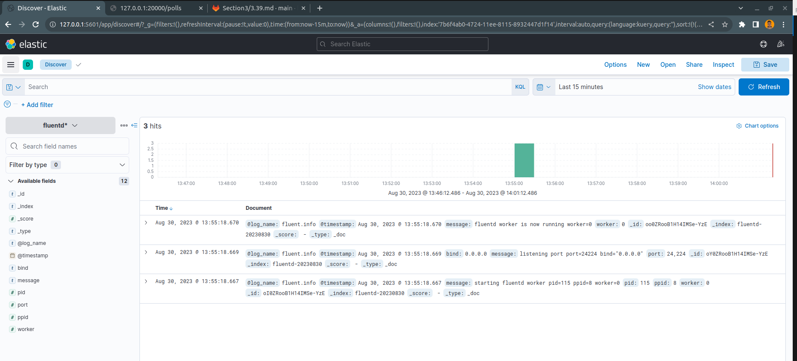

# Official requirements for running application

## Platform
* `php >= 7.2` (served best with `FPM`)
* `MySQL` database backend
* `Redis` database backend

## Run configuration
Application entrypoint is `public/index.php`, all the requests must be marshalled here.
When running application rely on environment variables. Initial subset of variables is expected in `.env` located
in project root. `.env.dist` can be used as a blueprint. 

## Database
Application uses MySQL and Redis as storage backends.

#### Migration
```shell script
$ php artisan migrate --force
```
Rollback failed migration:
```
$ php artisan migrate:rollback --force
```

#### Seeding command
*Usually takes place upon first deployment to populate DB with initial values*
```shell script
$ php artisan db:seed --force
```

### API

* RPC `[GET] /ping` - health check endpoint must return 200 OK if service is configured
* REST resource `/polls` - polls CRUD
* RPC `[POST] /polls/{id}/vote` - to vote in defined poll
* RPC `[GET] /polls/{id}/results` - poll results
* RPC `[GET] /summary` - polls summary

### CLI

```
# Periodic collect to aggregate polls statustics which will be used in /summary API endpoint
$ php artisan polls:collect:status

# Running unit tests
$ php vendor/bin/phpunit -c phpunit.xml 
```
---

# Task 29 Compose. Хранение логов в EFK

## <center>Checkpoints</center>

#### 1. В репозитории из предыдущего задания создайте новую ветку с именем dkr-31-voting-efk.

#### 2. Измените docker-compose.yml файл, добавив следующее:

#### 3. добавьте EFK стек;

#### 4. Fluentd должен быть доступен с хоста;

#### 5. Kibana должна быть доступна с хоста;

#### 6. остальные сервисы должны отправлять логи в fluentd через fluentd log driver.

#### 7. Запустите сервис с именем проекта rbm31.

#### 8. Сконфигурируйте приложение, выполнив команды из раздела Migration и Seeding в README репозитория.

#### 9. Обратитесь к сервису по localhost:20000/polls (вы должны увидеть json-объект).

#### 10. Откройте Kibana в браузере и проверьте, что логи запроса присутствуют.

#### 11. Загрузите новую ветку с изменениями в репозиторий.

## <center>Выполнение</center>
### 1. Создадим новую ветку в директории, в которой находится проект с прошлого задания:
    git checkout -b dkr-31-voting-efk

### 2. Теперь изменим наш docker-compose.yml файл:
#### Добавим EFK stack в наш docker-compose.yml файл:

```
...
  fluentd: 
    build: ./fluentd
    image: fluent:own
    container_name: Fluent
    links:
      - elasticsearch
    depends_on:
      - elasticsearch
    ports:
      - 24224:24224
      - 24224:24224/udp

  elasticsearch:
    image: elasticsearch:7.17.0
    container_name: ESearch
    expose:
      - 9200
    environment:
      - discovery.type=single-node 
    volumes:
      - esdata:/usr/share/elasticsearch/data

  kibana:
    image: kibana:7.17.0
    container_name: Kibana
    links:
      - elasticsearch
    depends_on:
      - elasticsearch
    ports:
      - 5601:5601
    environment:
      - ELASTICSEARCH_HOSTS=http://elasticsearch:9200

networks:
  app-network:
volumes:
  esdata:

```

#### Опишем Dockerfile для fluentd. Создадим директорию fluentd и положим туда это:
```
FROM fluentd:v1.14-1

USER root

RUN apk add --no-cache --update --virtual .build-deps \
        sudo build-base ruby-dev \
&& gem uninstall -I elasticsearch \
&& gem install elasticsearch -v 7.17.0 \
&& sudo gem install fluent-plugin-elasticsearch \
&& sudo gem sources --clear-all \
&& apk del .build-deps \
&& rm -rf /tmp/* /var/tmp/* /usr/lib/ruby/gems/*/cache/*.gem

COPY ./conf/fluent.conf /fluentd/etc/
COPY entrypoint.sh /bin/

RUN chmod +x /bin/entrypoint.sh

USER fluent
```
#### Затем в ту же папку необходимо добавить определенный скрипт, который используется для работы с конфигурацией логов:
```
#!/bin/sh

#source vars if file exists
DEFAULT=/etc/default/fluentd

if [ -r $DEFAULT ]; then
    set -o allexport
    . $DEFAULT
    set +o allexport
fi

# If the user has supplied only arguments append them to `fluentd` command 
if [ "${1#-}" != "$1" ]; then
    set -- fluentd "$@"
fi

# If user does not supply config file or plugins, use the default 
if [ "$1" = "fluentd" ]; then
    if ! echo $@ | grep -e ' \-c' -e ' \-\-config' ; then
      set -- "$@" --config /fluentd/etc/${FLUENTD_CONF}
    fi

    if ! echo $@ | grep -e ' \-p' -e ' \-\-plugin' ; then
      set -- "$@" --plugin /fluentd/plugins
    fi
fi

exec "$@"
```
#### В директории fluentd необходимо создать еще одну директориюю /conf и туда положить файлик конфигурации fluent.conf
```
<source>
  @type forward
  port 24224
  bind 0.0.0.0
</source>

<match *.**>
  @type copy
  <store>
    @type elasticsearch
    host elasticsearch
    port 9200
    logstash_format true
    logstash_prefix fluentd
    logstash_dateformat %Y%m%d
    include_tag_key true
    type_name access_log
    tag_key @log_name
    flush_interval 300s
  </store>
  <store>
    @type stdout
  </store>
</match>
```

#### В общем и целом древо директорий выглядит следующим образом:


### Далее запустим наш docker-compose файл с именем проекта rbm31:
    docker-compose -p rbm31 up --force-recreate

### Зайдем внутрь контейнера с приложением voting:
    docker exec -ti rbm31_voting_1 sh

### И выполним там миграции и посев данных:
    php artisan migrate --force
    php artisan db:seed --force

### Видим, что наше приложение работает:


### Далее необходимо обратиться на порт 5601 и создать index с именем fluent*. Вот готовый результат:


### Далее всё запушим в нашу ветку:
    git add .
    git commit -m "feat: accomplish task"
    git push