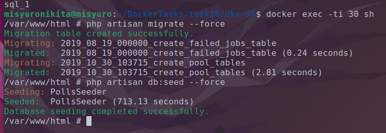
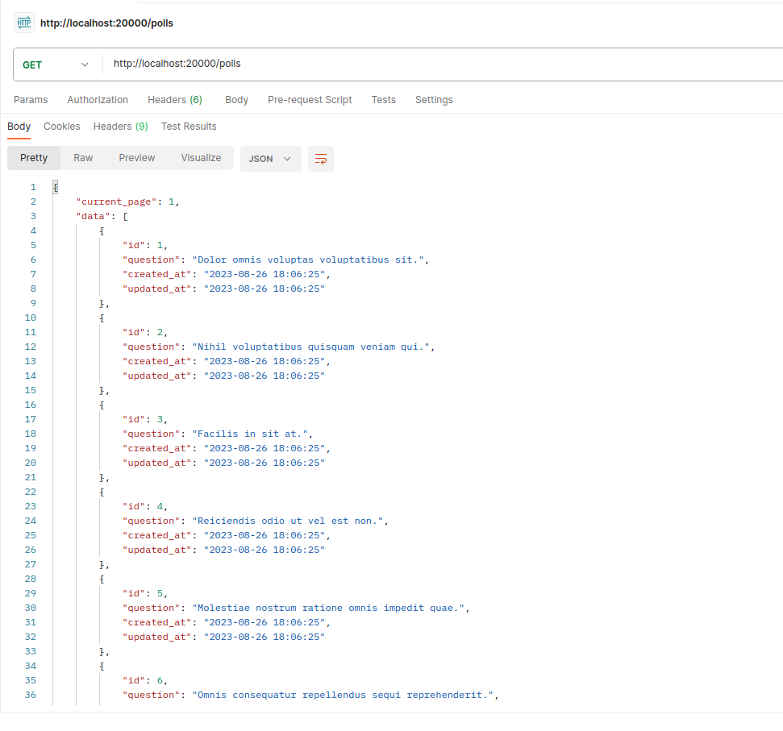

# Official requirements for running application

## Platform
* `php >= 7.2` (served best with `FPM`)
* `MySQL` database backend
* `Redis` database backend

## Run configuration
Application entrypoint is `public/index.php`, all the requests must be marshalled here.
When running application rely on environment variables. Initial subset of variables is expected in `.env` located
in project root. `.env.dist` can be used as a blueprint. 

## Database
Application uses MySQL and Redis as storage backends.

#### Migration
```shell script
$ php artisan migrate --force
```
Rollback failed migration:
```
$ php artisan migrate:rollback --force
```

#### Seeding command
*Usually takes place upon first deployment to populate DB with initial values*
```shell script
$ php artisan db:seed --force
```

### API

* RPC `[GET] /ping` - health check endpoint must return 200 OK if service is configured
* REST resource `/polls` - polls CRUD
* RPC `[POST] /polls/{id}/vote` - to vote in defined poll
* RPC `[GET] /polls/{id}/results` - poll results
* RPC `[GET] /summary` - polls summary

### CLI

```
# Periodic collect to aggregate polls statustics which will be used in /summary API endpoint
$ php artisan polls:collect:status

# Running unit tests
$ php vendor/bin/phpunit -c phpunit.xml 
```
---
# Task 28. Compose. Запуск compose со сборкой образа

## <center>Checkpoints</center>

#### 1. Склонируй репозиторий voting в свой аккаунт на devops-gitlab.inno.ws с именем dkr-30-voting.

#### 2. Напиши docker-compose.yml файл, который бы собирал приложение, запускал его и все требуемые зависимости:

- nginx - проксирует запросы на voting и доступен на хосте на порту 20000. Пример конфигурационного файла находится в папке nginx, смонтируй его в /etc/nginx/conf.d/default.conf. Используй alpine-версию образа.

- voting - собирается из репозитория;

- mysql - база данных, к которой подключается voting;

- redis - In-memory хранилище для кэша;

#### 3. Запусти сервис с именем проекта inno30.

#### 4. Сконфигурируй приложение, выполнив команды из раздела Migration и Seeding в README репозитория.

#### 5. Обратись к сервису по localhost:20000/polls (в ответе ты должен увидеть json-объект).

#### 6. Загрузи новые файлы в репозиторий

## <center>Accomplishment</center>
### 1. The first step is cloning [voting](https://devops-gitlab.inno.ws/devops-board/dkr-30) repository in our repository:
    git clone ssh://git@devops-gitlab.inno.ws:54042/devops-board/dkr-30.git

### 2. Then we have to write docker-compose.yml file using above circumstances:
```
version: '3'
services:

  nginx:
    image: nginx:alpine
    ports:
      - "20000:80"
    volumes:
      - "~/DockerTasks/task28/dkr-30/nginx/default.conf:/etc/nginx/conf.d/default.conf"
    restart: unless-stopped
    depends_on:
      - voting 

  voting:
    build: ./
    ports:
      - "9000:9000"
    env_file:
      - .env
    restart: unless-stopped
    depends_on:
      - mysql
      - redis
    healthcheck:
      test: ["CMD", "curl", "-f", "http://localhost:9000/ping"]
      interval: 30s
      timeout: 30s
      retries: 5

  mysql:
    image: mysql:5.7
    ports:
      - "3306:3306"
    environment:
      MYSQL_DATABASE: voting
      MYSQL_PASSWORD: voting
      MYSQL_USER: voting
      MYSQL_ROOT_PASSWORD: root
    restart: unless-stopped
    
  redis:
    image: redis:7.2.0
    restart: unless-stopped
```
### There are some important stuff: we need to rename [.env.dist](https://devops-gitlab.inno.ws/devops-board/dkr-30/-/blob/master/.env.dist) to `.env`. Other files we haven't to touch!

### 3. Well, let's run our container:
    docker-compose -p inno30 up --force-recreate

### 4. Then we need to make migraions and seed data inside container:
    docker exec -ti inno30_voting_1 sh
### Let's check the commands which describes into REDAME.md. There are we have two commands that we need to wrirte inside of container:
    php artisan migrate --force

    php artisan db:seed --force



### 5. Now we have to make sure that our application is working. I use Postman for check this cases:


### 6. Finally load our changes in our remote repository using these commands:
    git init 

    git add .

    git commit -m "feat: deploy backend laravel application"

    git remote add origin git@github.com:Misyuronikita/devops-docker-task28.git

    git push -u origin master


# Task 29 Compose. Хранение логов в EFK

## <center>Checkpoints</center>
#### 1. В репозитории из предыдущего задания создайте новую ветку с именем dkr-31-voting-efk.

#### 2. Измените docker-compose.yml файл, добавив следующее:

#### 3. добавьте EFK стек;

#### 4. Fluentd должен быть доступен с хоста;

#### 5. Kibana должна быть доступна с хоста;

#### 6. остальные сервисы должны отправлять логи в fluentd через fluentd log driver.

#### 7. Запустите сервис с именем проекта rbm31.

#### 8. Сконфигурируйте приложение, выполнив команды из раздела Migration и Seeding в README репозитория.

#### 9. Обратитесь к сервису по localhost:20000/polls (вы должны увидеть json-объект).

#### 10. Откройте Kibana в браузере и проверьте, что логи запроса присутствуют.

#### 11. Загрузите новую ветку с изменениями в репозиторий.

## <center>Выполнение</center>